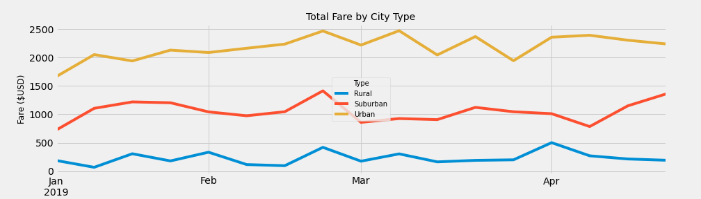

# PyBer_Analysis

## Overview of the Analysis

PyBer, a Python-based ride-sharing company, requested an exploratory analysis to explore the relationship between the type of city, and the number of drivers and riders.  Using Python scripts, Pandas library, Matplotlib, and Jupyter Notebook, data for rides between 1/1/2019 and 4/29/2019 was analyzed and visualized with various charting methods.  After an initial assessment, a second analysis was requested on the ride-sharing data by city type, with a graph to visualize the total weekly fares for each city type.  The purpose of this second analysis and visualization is to give PyBer leadership more decision-making information to improve access to, and affordability of, ride-sharing services in underserved neighborhoods.

## Results

## Summary
