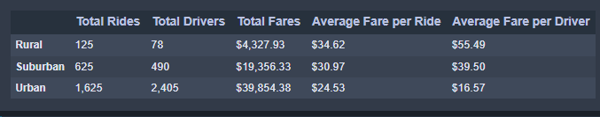

# PyBer_Analysis

## Overview of the Analysis

PyBer, a Python-based ride-sharing company, requested an exploratory analysis to explore the relationship between the type of city, and the number of drivers and riders.  Using Python scripts, Pandas library, Matplotlib, and Jupyter Notebook, data for rides between 1/1/2019 and 4/29/2019 was analyzed and visualized with various charting methods.  After an initial assessment, a second analysis was requested on the ride-sharing data by city type, with a graph to visualize the total weekly fares for each city type.  The purpose of this second analysis and visualization is to give PyBer leadership more decision-making information to improve access to, and affordability of, ride-sharing services in underserved neighborhoods.

## Results

The results of analysis show a significant difference across 5 different metrics between rural, suburban, and urban city types.  Rides in rural cities totaled 125, suburban cities had 625 rides, and urban cities had 1,625 rides in the 4 months measured.  The total number of drivers in rural cities was much lower at 78, while suburban and urban cities had 490 and 2,405 drivers, respectively.  Total fares in urban cities was nearly 10 times higher than rural cities, bringing in nearly $40,000 in urban areas, compared to approximately $4300 in rural cities.  Suburban city total fares were approximately half that of urban at slightly over $19,000.  Conversely, the average fare per ride was $10 higher in rural areas than in urban cities, and average fare per driver was 3x higher in rural cities compared to urban areas.  Average fare per ride was nearly $35 in rural areas, $31 in suburban, and $25 in urban.  Average fare per driver was over $55 in rural areas, while suburban areas were close to $40 and urban areas approximately $17.   

Over the 4 month period, there were some fluctuations in the amount of total fares, but overall the total fares remained relatively steady for each city type. With the exception of a dip in early January, urban city total fares remained steady between $2000-2500 per week.  Suburban cities also had a dip in early January and early April, but most weeks remained between $900-1400 per week in total fares.  Rural cities peaked at the beginning of April at $500 for the week, but overall remained between approximately $100-400 during the 4-month period. 

## Summary
- We would recommend recruiting more drivers in rural areas that have demonstrated higher demand.  As the average fare per driver was demonstrated to be highest in rural areas, this could be a positive factor to influence recruitment of drivers in these underserved areas. However, as average fares in rural areas are considerably higher than suburban or urban, it may be useful for PyBer to study the demographics and average income of the rural communities it serves to determine if the higher average fare would price potential customers out of using the service. The distance needed to travel for rural riders may also be a factor in these higher fares as well. 
- The considerably lower average fare per driver in urban areas may be indicative of oversaturation of drivers in some areas, as well as total rides being lower than the total number of drivers in urban cities. More research into individual urban areas to look for the possibility of oversaturation/undersaturation of drivers should be explored.   
- Suburban areas appear to strike an overall positive balance of drivers to rides, as well as average fares per ride and driver. It may be worthwhile to look more into the suburban ratios to determine if similar ratios of rides to drivers might translate to the other city types.  
